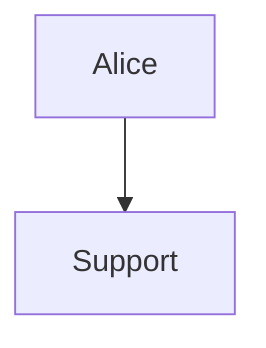

If you already have Obsidian installed, please skip to the next [[6. Install Git plugin for Obsidian|step]].

1. Open your browser and go to [Download Obsidian](https://obsidian.md/download).

```mermaid
graph TD
Alice --> Support
```
