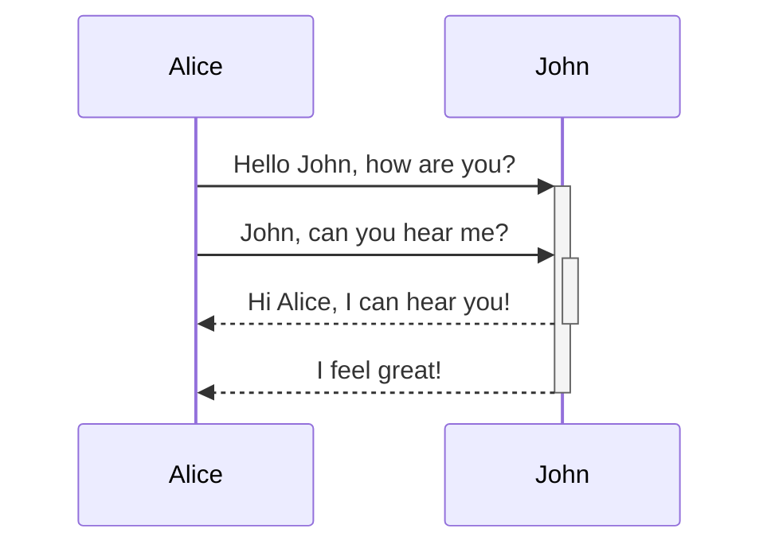
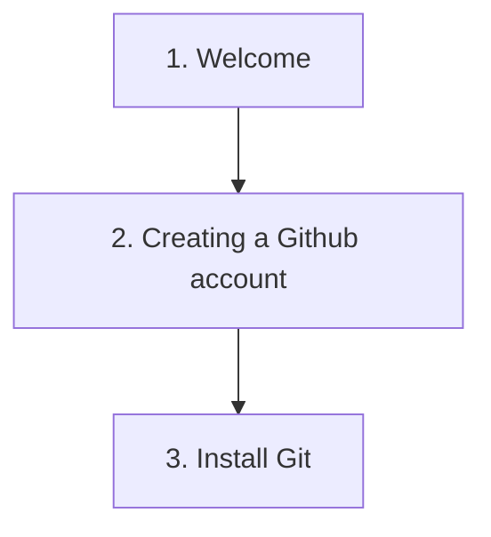

Graphs can be embedded into a page using a code block and entering the syntax to create a mermaid diagram as demonstrated below.

Further if you would like to create a graph that contains clickable links, they can be included by using the keyword "internal-link." Below is an example using the first three pages from the Getting Started guide.

Syntax reference: https://mermaid.js.org/intro/syntax-reference.html

#tips